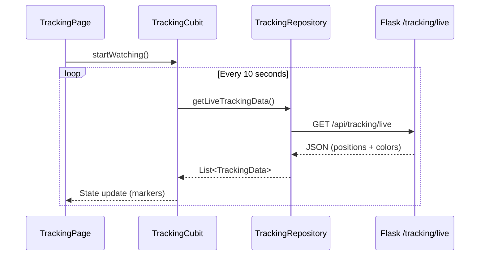

# Architecture Documentation

## Overview

The Sorrento Holy Week Tracker (Incappucciati) follows a **Monorepo** structure with two main components:

```
incappucciati/
├── mobile/    # Flutter mobile application
├── server/    # Python Flask backend
└── docs/      # Documentation
```

---

## Mobile Architecture (Flutter)

The mobile application follows **Clean Architecture** ("Onion Architecture") ensuring business logic isolation.

### Layer Diagram

```
┌─────────────────────────────────────────┐
│         Presentation Layer              │
│   (Pages, Widgets, Cubits, BLoC)       │
├─────────────────────────────────────────┤
│           Domain Layer                  │
│   (Entities, Repositories Interfaces)  │
├─────────────────────────────────────────┤
│            Data Layer                   │
│   (Implementations, Data Sources)      │
└─────────────────────────────────────────┘
```

### Layers

#### 1. Domain Layer (Core)
- **Entities**: Pure Dart classes (`Confraternity`, `TrackingData`, `Weather`)
- **Repositories (Interfaces)**: Abstract definitions of data operations

#### 2. Data Layer
- **Repositories (Implementations)**: Concrete implementations with caching, HTTP, platform detection
- **Data Sources**: Remote (HTTP) and Local (SharedPreferences) sources

#### 3. Presentation Layer
- **State Management**: `flutter_bloc` (Cubits)
- **Pages**: Full-screen widgets (`HomePage`, `TrackingPage`, `WeatherPage`, `ConfraternityDetailPage`)
- **Navigation**: Centralized `AppRouter` with typed arguments

### Dependency Injection

Manual DI via `RepositoryProvider` and `BlocProvider`:
- Repositories injected at app level in `main.dart`
- Cubits injected at page level with scoped lifecycle

### Key Features

| Feature | Components |
|---------|------------|
| **Home** | `HomeCubit`, `HomeRepository`, local caching |
| **Tracking** | `TrackingCubit`, `MapController`, auto-zoom, colored markers |
| **Weather** | `WeatherCubit`, `TabController`, municipality tabs |
| **Navigation** | `AppRouter`, typed `Args` classes |

---

## Backend Architecture (Flask)

Lightweight REST API with Swagger documentation.

### Components

| Component | File | Purpose |
|-----------|------|---------|
| App Factory | `app/__init__.py` | Flask + SQLAlchemy + Flasgger setup |
| Models | `app/models.py` | `Confraternity`, `Procession`, `TrackingLog` |
| Routes | `app/routes.py` | API endpoints with OpenAPI docstrings |
| Entry Point | `run.py` | Development server |
| Seed Data | `seed.py` | Populate database with 8 confraternities |

### API Documentation

- **Swagger UI**: `http://localhost:5000/docs`
- **OpenAPI JSON**: `http://localhost:5000/apispec.json`

---

## Data Flow (Tracking Example)



---

## Technology Stack

### Mobile
| Concern | Technology |
|---------|------------|
| Framework | Flutter 3.x |
| State | flutter_bloc |
| HTTP | http package |
| Maps | flutter_map (OSM) |
| Caching | shared_preferences |

### Backend
| Concern | Technology |
|---------|------------|
| Framework | Flask |
| ORM | SQLAlchemy |
| Database | SQLite |
| API Docs | Flasgger (OpenAPI 3.0) |
