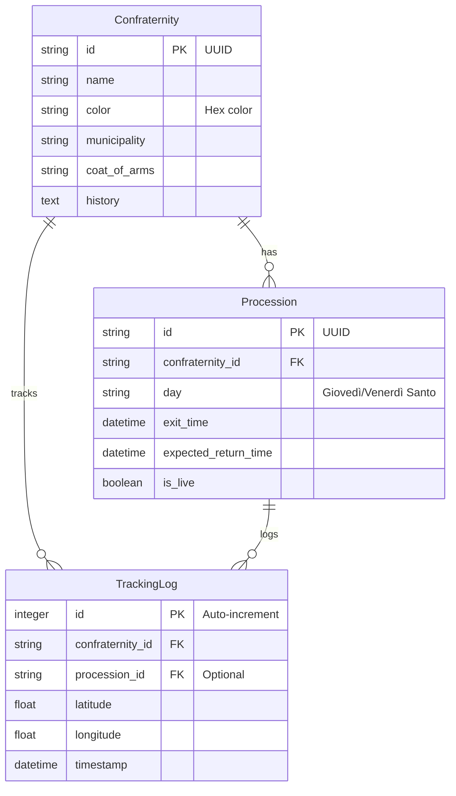

# Database Schema

The project uses **SQLite** for development and production simplicity.

## Entity Relationship Diagram

## Tables

### 1. `confraternities`
Static information about the religious brotherhoods.

| Column | Type | Description |
|--------|------|-------------|
| `id` | String (PK) | Unique ID (UUID format) |
| `name` | String | Official Name |
| `color` | String | Identifying Hex Color (e.g. #000000) |
| `municipality`| String | Based in (Sorrento, Meta, etc.) |
| `coat_of_arms`| String | URL/Path to image |
| `history` | Text | Historical descriptions |

### 2. `processions`
Links a confraternity to a specific event in the Holy Week calendar.

| Column | Type | Description |
|--------|------|-------------|
| `id` | String (PK) | Unique ID |
| `confraternity_id`| String (FK) | Reference to `confraternities.id` |
| `day` | String | "Giovedì Santo", "Venerdì Santo" etc. |
| `exit_time` | DateTime | Scheduled start |
| `expected_return_time`| DateTime | Scheduled end |
| `is_live` | Boolean | Whether the procession is currently active |

### 3. `tracking_logs`
Unified GPS position logs for all processions (historical and live).

| Column | Type | Description |
|--------|------|-------------|
| `id` | Integer (PK) | Auto-increment ID |
| `confraternity_id`| String (FK) | Reference to `confraternities.id` |
| `procession_id`| String (FK, nullable) | Optional reference to `processions.id` |
| `latitude` | Float | GPS Latitude |
| `longitude` | Float | GPS Longitude |
| `timestamp` | DateTime | Time of position log (ISO 8601) |

**Index**: `(confraternity_id, timestamp DESC)` for efficient "latest position" queries.

> **Note**: The old `tracking` table has been removed. All tracking is now unified in `tracking_logs`.
