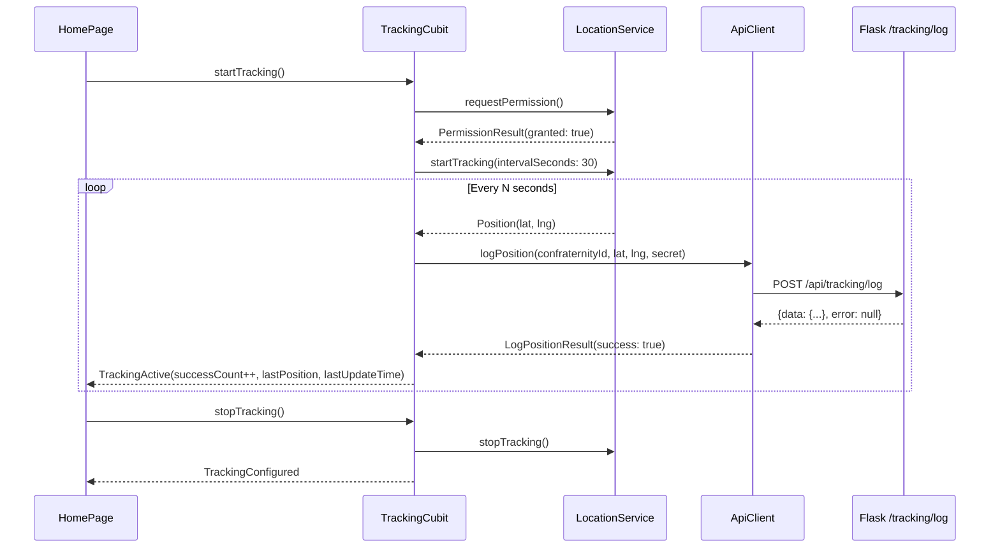

# Tracker App — AI Agent Guidelines

> **Package name**: `tracker_app`
> **Framework**: Flutter 3.x+ · Dart SDK ^3.9.2
> **Platform**: Android only

---

## 1. Purpose

The **Tracker App** is a separate, lightweight Flutter application used exclusively by the **capofila** (the leader of each confraternity's procession). Its sole purpose is to:

1. **Configure** which confraternity it is tracking (select from server-provided list).
2. **Start/Stop** GPS location tracking.
3. **Push** GPS position updates to the backend server at regular intervals via `POST /api/tracking/log`.

This app is **NOT** the public-facing app — that is `mobile/`. This app is an internal tool operated by a single person per confraternity during live processions.

---

## 2. Architecture

The tracker app follows a **simplified Clean Architecture** — it does not have a full feature-first structure since it has only one feature (tracking). It still maintains clear layer separation.

### Layer Diagram

```
┌───────────────────────────────────────────┐
│          Presentation Layer               │
│    (HomePage, TrackingCubit)              │
├───────────────────────────────────────────┤
│            Domain Layer                   │
│    (Confraternity, TrackingConfig)        │
├───────────────────────────────────────────┤
│             Data Layer                    │
│    (ApiClient, LocationService,           │
│     ConfigService)                        │
└───────────────────────────────────────────┘
```

---

## 3. Project Structure

```
tracker_app/
├── lib/
│   ├── data/
│   │   ├── api/
│   │   │   └── api_client.dart        # HTTP client: fetchConfraternities(), logPosition()
│   │   └── services/
│   │       ├── config_service.dart     # Persists TrackingConfig via SharedPreferences
│   │       └── location_service.dart   # GPS tracking via Geolocator, permission handling
│   │
│   ├── domain/
│   │   └── entities/
│   │       ├── confraternity.dart      # Confraternity entity (id, name, color, municipality)
│   │       └── tracking_config.dart    # TrackingConfig entity (confraternityId, secret, serverUrl, interval)
│   │
│   ├── presentation/
│   │   ├── cubit/
│   │   │   ├── tracking_cubit.dart     # Main cubit: init, config, start/stop tracking
│   │   │   └── tracking_state.dart     # Sealed states: Initial, Configured, Active, Error
│   │   └── pages/
│   │       └── home_page.dart          # Single-page UI: config form + tracking controls
│   │
│   └── main.dart                       # Entry point, creates TrackingCubit with services
│
├── android/                            # Android-specific configuration
├── pubspec.yaml
└── analysis_options.yaml
```

---

## 4. State Management

### TrackingCubit

Central cubit managing the app's entire lifecycle:

| Method | Purpose |
|--------|---------|
| `initialize()` | Load saved config from SharedPreferences, create ApiClient, attempt to fetch confraternities |
| `updateServerUrl(url)` | Change server URL, re-create ApiClient, re-fetch confraternities |
| `fetchConfraternities()` | GET `/api/confraternities` via ApiClient |
| `updateConfig(...)` | Update and persist confraternity selection, secret, interval |
| `startTracking()` | Validate config → request GPS permission → start LocationService → listen to position stream |
| `stopTracking()` | Cancel subscription, stop LocationService, return to Configured state |

### State Machine

```
TrackingInitial
    │ initialize()
    ▼
TrackingConfigured  ← (config, confraternities list, errorMessage?)
    │ startTracking()
    ▼
TrackingActive      ← (config, lastPosition, lastUpdateTime, successCount, failureCount, lastError?)
    │ stopTracking()
    ▼
TrackingConfigured  (back to config)
```

```
TrackingError       ← (message, config?, canRetry)
```

### Sealed States (tracking_state.dart)

```dart
sealed class TrackingState
├── TrackingInitial        // App just launched
├── TrackingConfigured     // Config loaded, ready to start (has copyWith)
├── TrackingActive         // GPS tracking active, sending positions (has copyWith)
└── TrackingError          // Fatal error
```

---

## 5. Data Layer

### ApiClient (`data/api/api_client.dart`)

Communicates with the Flask backend:

| Method | Endpoint | Purpose |
|--------|----------|---------|
| `fetchConfraternities()` | `GET /confraternities` | List confraternities for dropdown selection |
| `logPosition(...)` | `POST /tracking/log` | Send GPS position with capofila secret |

**Returns**: `LogPositionResult` (success/error) for position logging.
**Throws**: `ApiException` for HTTP errors.

### LocationService (`data/services/location_service.dart`)

Wraps the `geolocator` package for GPS tracking:

- `requestPermission()` → `PermissionResult` (handles denied, permanently denied, service disabled).
- `startTracking(intervalSeconds)` → Starts dual tracking:
  - `Timer.periodic` for consistent intervals.
  - `Geolocator.getPositionStream` with `AndroidSettings` for accuracy.
- `stopTracking()` → Cancels subscription.
- Exposes `positionStream` (broadcast `StreamController<Position>`).

### ConfigService (`data/services/config_service.dart`)

Persists `TrackingConfig` to SharedPreferences as JSON:

- `saveConfig(config)` — serialize and store.
- `loadConfig()` — deserialize or return `TrackingConfig.defaultConfig`.
- `clearConfig()` — remove stored config.

---

## 6. Domain Layer

### Confraternity Entity

```dart
class Confraternity {
  final String id;
  final String name;
  final String color;
  final String municipality;
  final String? coatOfArms;
  final String? history;

  factory Confraternity.fromJson(Map<String, dynamic> json);
}
```

### TrackingConfig Entity

```dart
class TrackingConfig {
  final String confraternityId;
  final String confraternityName;
  final String secret;
  final String serverUrl;
  final int intervalSeconds;

  // copyWith, toJson, fromJson
  static const defaultConfig = TrackingConfig(
    confraternityId: '',
    confraternityName: '',
    secret: 'capofila123',
    serverUrl: 'http://localhost:5000/api',
    intervalSeconds: 30,
  );
}
```

---

## 7. Backend Integration

### Server URL

Configurable in the app UI. Default: `http://localhost:5000/api`.
The URL is persisted with the rest of the config in SharedPreferences.

### Consumed Endpoints

| Endpoint | Method | Auth | Purpose |
|----------|--------|------|---------|
| `/confraternities` | GET | None | Populate confraternity dropdown |
| `/tracking/log` | POST | Capofila Secret | Send GPS position |

### POST `/tracking/log` Body

```json
{
  "confraternity_id": "uuid",
  "lat": 40.6263,
  "lng": 14.3758,
  "secret": "capofila123"
}
```

### Success Response

```json
{
  "data": {
    "id": 1,
    "confraternity_id": "uuid",
    "lat": 40.6263,
    "lng": 14.3758,
    "last_updated": "2026-01-17T00:00:00Z"
  },
  "error": null
}
```

### Error Response (401)

```json
{
  "data": null,
  "error": "Unauthorized - invalid secret"
}
```

---

## 8. GPS Tracking Flow



---

## 9. UI Structure (Single Page)

The app has a **single page** (`HomePage`) with different views based on state:

### TrackingConfigured State

- **Server URL** text field
- **Confraternity** dropdown (populated from server)
- **Interval** selector (seconds between GPS updates)
- **Secret** field (pre-filled with default)
- **Status card** showing connection status
- **Start Tracking** button

### TrackingActive State

- **Pulsing indicator** (live tracking animation)
- **Confraternity name** and color
- **Stats**: success count, failure count, last update time
- **Last position**: latitude, longitude
- **Last error** (if any)
- **Stop Tracking** button

### TrackingError State

- **Error message**
- **Retry** button (if `canRetry` is true)

---

## 10. Technology Stack

| Concern | Package |
|---------|---------|
| Framework | Flutter 3.x |
| State Management | `flutter_bloc` ^8.1.0 |
| HTTP Client | `http` ^1.2.0 |
| GPS | `geolocator` ^12.0.0 |
| Permissions | `permission_handler` ^11.3.0 |
| Config Persistence | `shared_preferences` ^2.2.0 |

---

## 11. Strict Rules

### ⚠️ No Code Generation

**Do NOT add** `build_runner`, `freezed`, `json_serializable`, or any codegen package.
All serialization is **manual** (`fromJson` / `toJson`).

### ⚠️ No Service Locators

**Do NOT use** `GetIt` or any service locator. Dependencies are injected through **constructors**.

### Platform

This app targets **Android only**. Android-specific settings (like `AndroidSettings` in Geolocator) are used directly.

### Coding Standards

- Use `const` constructors wherever possible.
- Keep functions under **30 lines**.
- Follow SOLID principles.
- Sound Null Safety.

### Git Commits

Use **Conventional Commits**: `feat:`, `fix:`, `docs:`, `refactor:`.

---

## 12. Dependency Injection

In `main.dart`, the `TrackingCubit` is created with its dependencies:

```dart
BlocProvider(
  create: (_) => TrackingCubit(
    configService: ConfigService(),
    locationService: LocationService(),
  )..initialize(),
  child: const HomePage(),
)
```

- `ConfigService` and `LocationService` are injected via constructors.
- `ApiClient` is created internally by the cubit when the server URL is configured.

---

## 13. Useful Commands

```bash
# Install dependencies
flutter pub get

# Run on connected Android device/emulator
flutter run

# Analyze code
flutter analyze

# Run tests
flutter test
```

---

## 14. Future Considerations

- **Background tracking**: The current implementation requires the app to be in the foreground. A background service using `flutter_background_service` or `workmanager` may be needed.
- **Battery optimization**: Consider reducing GPS accuracy when battery is low.
- **Offline queue**: Buffer GPS positions locally when network is unavailable and sync when reconnected.
- **Foreground notification**: Display a persistent notification while tracking is active (Android requirement for background location).
